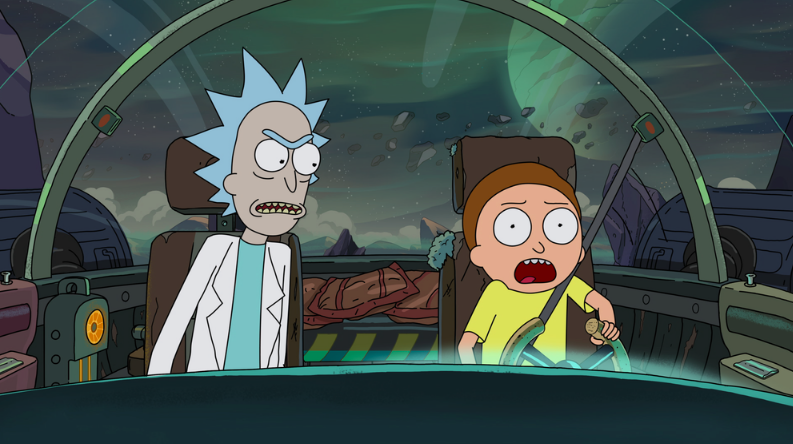

<p align="center">
   
</p>

# Rick and morty

Next.js App with Apollo Client and GraphQL

## :construction_worker: Running Locally

```
$ git clone https://github.com/dohafaridi/rick-and-morty.git
$ cd rick-and-morty
$ yarn
$ yarn dev
```

Open [http://localhost:3000](http://localhost:3000) with your browser to see the result.
